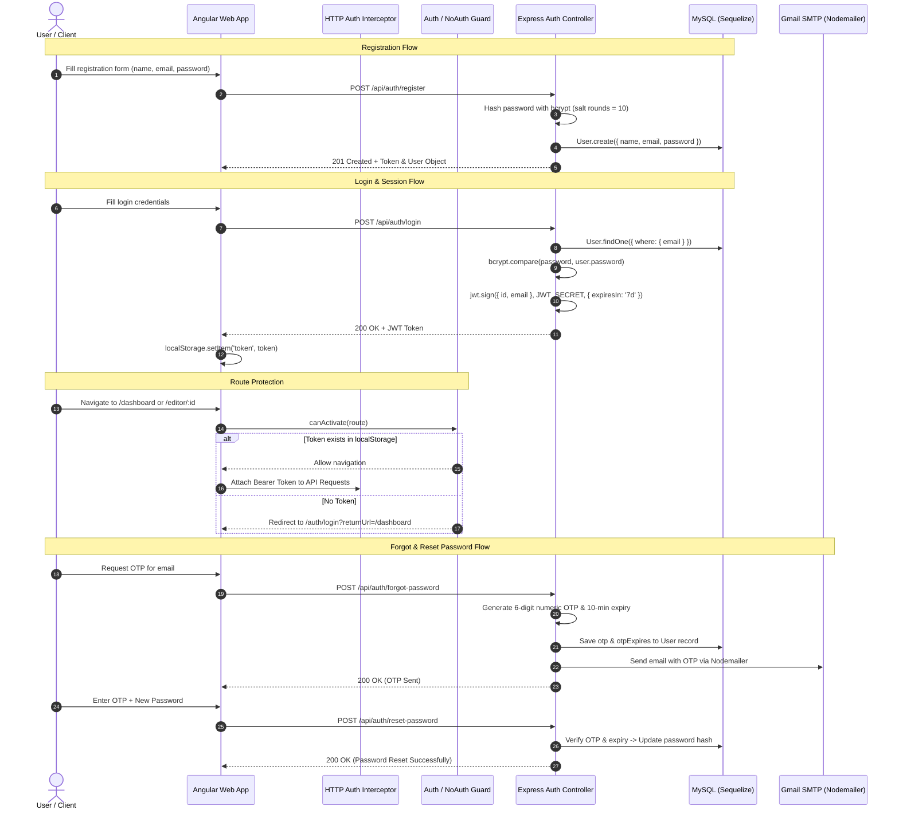

# Feature Specification: Authentication & Security Architecture

## 1. Overview
The Authentication & Security module manages user registration, login, secure token-based session persistence, route protection via Angular Route Guards, and a secure OTP-based password reset mechanism via Nodemailer.

---

## 2. Architecture & Flow Diagram

---

## 3. Implementation Details

### A. Frontend Layer
- **AuthService** (`src/app/auth/auth.service.ts`): Centralized service handling login, registration, password recovery, token storage in `localStorage`, and reactive state observables.
- **Route Guards**:
  - `AuthGuard` (`src/app/auth/auth.guard.ts`): Protects workspace, editor, and dashboard routes from unauthorized access.
  - `NoAuthGuard` (`src/app/auth/no-auth.guard.ts`): Prevents logged-in users from accessing `/auth/login` or `/auth/signup`, redirecting them to `/dashboard`.
- **AuthInterceptor** (`src/app/auth/auth.interceptor.ts`): Intercepts all outgoing HTTP requests and appends `Authorization: Bearer <token>` header automatically.
- **UI Components**:
  - `LoginComponent` & `SignupComponent`: Split-screen layout with password visibility toggle and form validation.
  - `ForgotPasswordComponent` & `ResetPasswordComponent`: Step-by-step OTP verification flow.

### B. Backend Layer
- **AuthController** (`controllers/authController.js`):
  - `register`: Validates input, hashes password using `bcrypt`, creates user, and returns JWT.
  - `login`: Compares hashed passwords and signs JWT.
  - `forgotPassword`: Generates secure temporary OTP and dispatches email.
  - `resetPassword`: Validates OTP match and expiration before applying the new password hash.
- **Middleware** (`middleware/auth.js`): Verifies the incoming Bearer token from the `Authorization` header using `jsonwebtoken` and attaches `req.user`.

---

## 4. API Reference

| Endpoint | Method | Payload | Description |
| :--- | :---: | :--- | :--- |
| `/api/auth/register` | `POST` | `{ name, email, password }` | Creates user account & returns token |
| `/api/auth/login` | `POST` | `{ email, password }` | Authenticates user & returns JWT |
| `/api/auth/forgot-password` | `POST` | `{ email }` | Dispatches 6-digit OTP to user email |
| `/api/auth/reset-password` | `POST` | `{ email, otp, newPassword }` | Verifies OTP and updates password |

---

## 5. Security & Edge Cases
- **Password Hashing**: Never stores plain text; hashes with salt rounds = 10.
- **Token Invalidation**: Frontend `AuthService.logout()` wipes localStorage immediately.
- **OTP Expiration**: OTPs are timestamped and automatically expire after 10 minutes.
- **SQL Injection Prevention**: Sequelize parameterized queries prevent raw SQL injection vulnerabilities.
