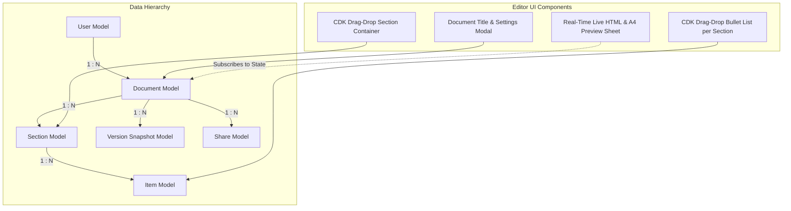
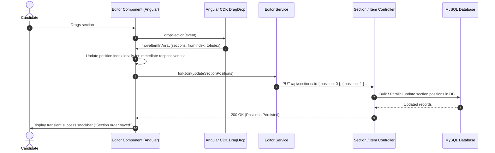

# Feature Specification: Interactive Resume Editor

## 1. Overview
The Interactive Resume Editor is the core content-creation interface of ResumeFlow. It allows users to build resumes structured hierarchically into **Documents**, **Sections** (e.g., Experience, Education, Skills), and **Items** (individual bullet points). It supports real-time editing, Angular CDK drag-and-drop reordering, and version snapshots.

---

## 2. Architecture & Data Model Diagram



### Drag & Drop Sequence Flow



---

## 3. Implementation Details

### A. Frontend Layer
- **EditorComponent** (`src/app/workspace/pages/editor/editor.component.ts`):
  - Manages active document state, sections list, version history, and public shares.
  - Implements Angular CDK `dropSection()` and `dropItem()` to allow reordering sections and nested bullet points.
  - Employs `forkJoin` for batched network updates during drag-and-drop actions.
  - Implements `showSuccess()` and `showError()` with automatic dismissal timers (2.2s - 3s) for seamless feedback.
  - Real-time live preview that synchronizes with every keystroke and profile photo upload.
- **EditorService** (`src/app/workspace/services/editor.service.ts`):
  - CRUD operations for sections (`listSections`, `createSection`, `updateSection`, `removeSection`).
  - CRUD operations for bullet items (`listItems`, `createItem`, `updateItem`, `removeItem`).
  - Version management (`listVersions`, `createVersion`).

### B. Backend Layer
- **DocumentController** (`controllers/documentController.js`):
  - Manages Document creation, updates, and list operations per user.
- **SectionController** (`controllers/sectionController.js`):
  - Creates and updates section titles, `position` indices, and `isSidebar` flags.
  - Verifies ownership up the chain: `Section -> Document.userId === req.user.id`.
- **ItemController** (`controllers/itemController.js`):
  - Handles item creation, bullet text updates, position reordering, and deletions with nested ownership validation.
- **VersionController** (`controllers/versionController.js`):
  - Stores JSON snapshot representations of the entire resume structure at a given point in time.

---

## 4. Database Schema Relationships

```text
Documents
  ├── id (PK)
  ├── userId (FK -> Users.id)
  ├── title (VARCHAR)
  ├── type (ENUM: 'resume', 'cv', 'cover-letter')
  └── templateId (FK -> Templates.id, Nullable)

Sections
  ├── id (PK)
  ├── documentId (FK -> Documents.id, ON DELETE CASCADE)
  ├── heading (VARCHAR)
  ├── position (INTEGER)
  └── isSidebar (BOOLEAN)

Items
  ├── id (PK)
  ├── sectionId (FK -> Sections.id, ON DELETE CASCADE)
  ├── content (TEXT)
  └── position (INTEGER)
```

---

## 5. Security & Cascading Rules
- **Ownership Verification**: Every modification verifies that `section.Document.userId === req.user.id`.
- **Cascading Deletions**: Deleting a document automatically cleans up all associated sections and items to prevent orphaned database records.
