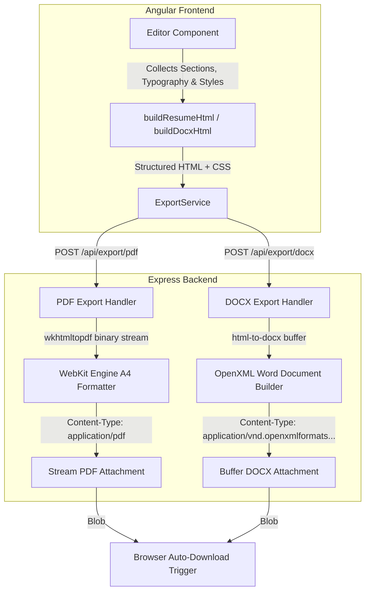
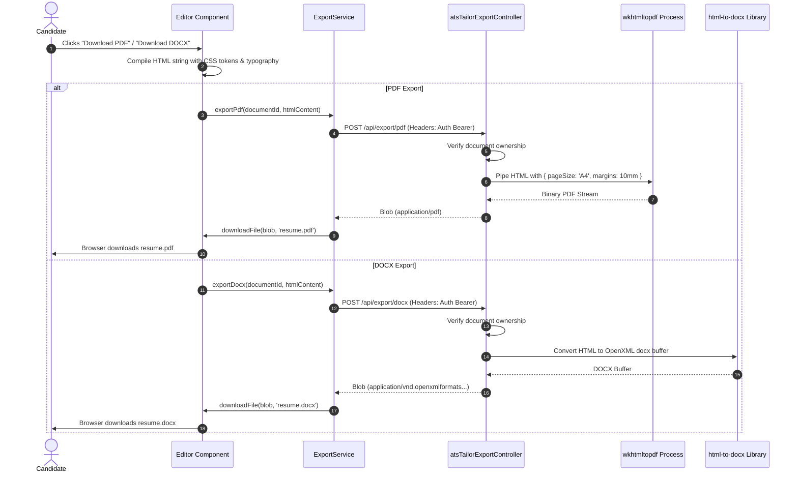

# Feature Specification: Multi-Format Export Engine (PDF & DOCX)

## 1. Overview
The Export Engine converts rich HTML resume structures into standard downloadable formats:
1. **High-Fidelity PDF**: Rendered server-side using the WebKit rendering engine via `wkhtmltopdf` for selectable text, high resolution, and ATS scanner compatibility.
2. **Editable DOCX**: Word document generation using `html-to-docx` for applicants needing to submit editable `.docx` files.

---

## 2. Architecture & Export Pipeline

### Export Execution Flow

---

## 3. Implementation Details

### A. Frontend Layer
- **ExportService** (`src/app/workspace/services/export.service.ts`):
  - `exportPdf(documentId, htmlContent)`: Sends payload to backend and expects `responseType: 'blob'`.
  - `exportDocx(documentId, htmlContent)`: Sends payload to backend and expects `responseType: 'blob'`.
  - `downloadFile(blob, filename)`: Utility method utilizing `URL.createObjectURL(blob)` and an invisible anchor tag trigger for seamless browser downloading.
- **HTML Compilers in EditorComponent**:
  - `buildResumeHtml()`: Assembles clean semantic HTML with CSS styling, accent colors, header metadata, and bullet list hierarchies for PDF rendering.
  - `buildDocxHtml()`: Generates structured HTML compatible with OpenXML Word parser specifications.

### B. Backend Layer
- **atsTailorExportController** (`controllers/atsTailorExportController.js`):
  - `exportPdf`: Invokes `wkhtmltopdf` with specific A4 page dimensions, margins, and UTF-8 encoding options, piping the binary stream directly into the HTTP response.
  - `exportDocx`: Calls `html-to-docx` to construct an in-memory document buffer and sets corresponding OpenXML mime-type headers.
- **ExportRoutes** (`routes/exportRoutes.js`):
  - `POST /api/export/pdf` (Protected by `auth` middleware).
  - `POST /api/export/docx` (Protected by `auth` middleware).

---

## 4. Configuration & Environment Requirements
- **Server Dependency**: `wkhtmltopdf` must be installed on the host system:
  - Windows: Installed at `C:\Program Files\wkhtmltopdf\bin\wkhtmltopdf.exe` or available on system PATH.
  - Linux/Production: `apt-get install wkhtmltopdf`.
- **Payload Limit**: Express JSON parser limit set to `2mb` in `app.js` (`app.use(express.json({ limit: "2mb" }))`) to comfortably accept large HTML resume payloads.
