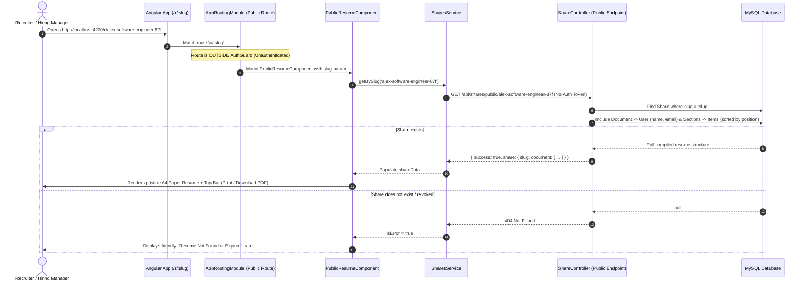

# Feature Specification: Public Shareable Resume Viewer (/r/:slug)

## 1. Overview
The Public Shareable Viewer enables candidates to generate dedicated, vanity public URLs (`/r/:slug`) for their resumes. Anyone holding the link (e.g., recruiters, hiring managers, clients) can review the resume without creating an account or logging in.

---

## 2. Architecture & Public Access Flow

---

## 3. Implementation Details

### A. Frontend Layer
- **PublicResumeComponent** (`src/app/public-resume/public-resume.component.ts`):
  - Extracts the dynamic `:slug` route parameter via Angular `ActivatedRoute`.
  - Manages asynchronous states: `isLoading`, `isError`, `isDownloading`, and `shareData`.
  - Methods:
    - `printResume()`: Triggers native `window.print()`.
    - `downloadPdf()`: Compiles formatted HTML and calls `ExportService.exportPdf()` for server-rendered PDF.
- **Template & Styling** (`public-resume.component.html`, `public-resume.component.scss`):
  - Sticky top action bar with brand logo, Print, Download PDF, and "Build Your Resume" conversion CTA.
  - Centered A4 canvas styled with realistic paper elevation shadows.
  - Comprehensive `@media print` rules to suppress top bars and force full-fidelity print output.
- **Routing** (`src/app/app-routing.module.ts`):
  - Declared at root level `{ path: 'r/:slug', component: PublicResumeComponent }` outside the `canActivate: [AuthGuard]` block.

### B. Backend Layer
- **ShareController** (`controllers/shareController.js`):
  - `getBySlug`: Public controller finding `Share` by slug, including nested relational data: `Document -> User` (name, email), `Sections -> Items`. Sorts sections and bullet points by their respective `position` indices.
- **ShareRoutes** (`routes/shareRoutes.js`):
  - Unauthenticated route: `router.get("/public/:slug", shareController.getBySlug)`.

---

## 4. API Reference

| Endpoint | Method | Auth | Description |
| :--- | :---: | :---: | :--- |
| `/api/shares/public/:slug` | `GET` | None | Returns public resume data for the specified slug |
| `/api/shares` | `POST` | Bearer | Creates a new share slug for a document |
| `/api/shares/document/:documentId` | `GET` | Bearer | Lists all active shares for a document |
| `/api/shares/:id` | `DELETE` | Bearer | Revokes/deletes a share link |

---

## 5. Security & Privacy
- **Selective Field Exposure**: The public endpoint only exposes the candidate's public profile fields (name, email) and resume sections/items; sensitive user credentials and internal metadata are strictly omitted.
- **Instant Revocation**: When a candidate clicks "Revoke Link" in their editor, the corresponding database record is deleted and subsequent requests immediately return HTTP 404.
