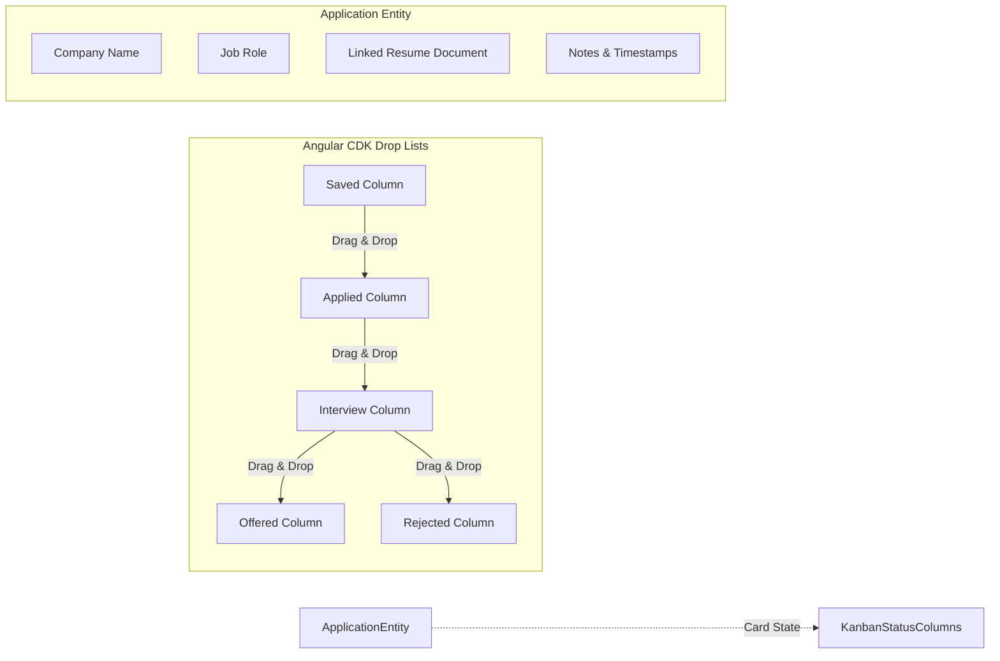
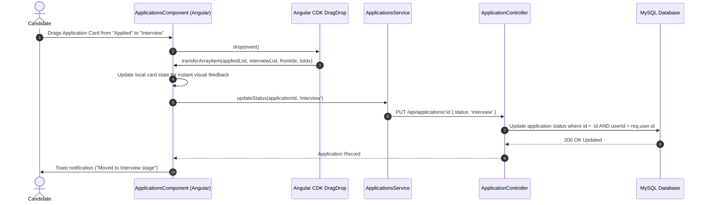

# Feature Specification: Job Applications Tracker (Kanban Board)

## 1. Overview
The Applications Tracker allows job seekers to manage their full job search pipeline within ResumeFlow. Users can track job applications across lifecycle stages using an interactive **Kanban Board** with drag-and-drop column transitions or a structured **Table View**, linking specific tailored resumes to each application.

---

## 2. Architecture & Kanban Workflow



### Drag & Drop State Transition Flow



---

## 3. Implementation Details

### A. Frontend Layer
- **ApplicationsComponent** (`src/app/workspace/pages/applications/applications.component.ts`):
  - View modes: Toggle between **Kanban Board** and **Table View**.
  - Implements Angular CDK `CdkDragDrop`, `transferArrayItem`, and connected drop lists across all status columns: `saved`, `applied`, `interview`, `offered`, `rejected`.
  - Form validation for creating new applications with linked documents.
- **ApplicationsService** (`src/app/workspace/services/applications.service.ts`):
  - `list()`: Fetches all applications for the authenticated user.
  - `create(data)`: Creates a new tracked application linked to a resume document.
  - `update(id, data)`: Modifies company, role, status, or linked document.
  - `remove(id)`: Deletes an application record.

### B. Backend Layer
- **ApplicationController** (`controllers/applicationController.js`):
  - Enforces document ownership validation (`doc.userId === req.user.id`) before allowing an application to link to a resume.
  - CRUD operations filtered strictly by `req.user.id`.
- **ApplicationRoutes** (`routes/applicationRoutes.js`):
  - Resource routes secured by JWT `auth` middleware.

---

## 4. Database Schema Relationships

```text
Applications
  ├── id (PK)
  ├── userId (FK -> Users.id)
  ├── documentId (FK -> Documents.id)
  ├── company (VARCHAR)
  ├── role (VARCHAR)
  ├── status (ENUM: 'saved', 'applied', 'interview', 'offered', 'rejected')
  ├── createdAt (DATETIME)
  └── updatedAt (DATETIME)
```
