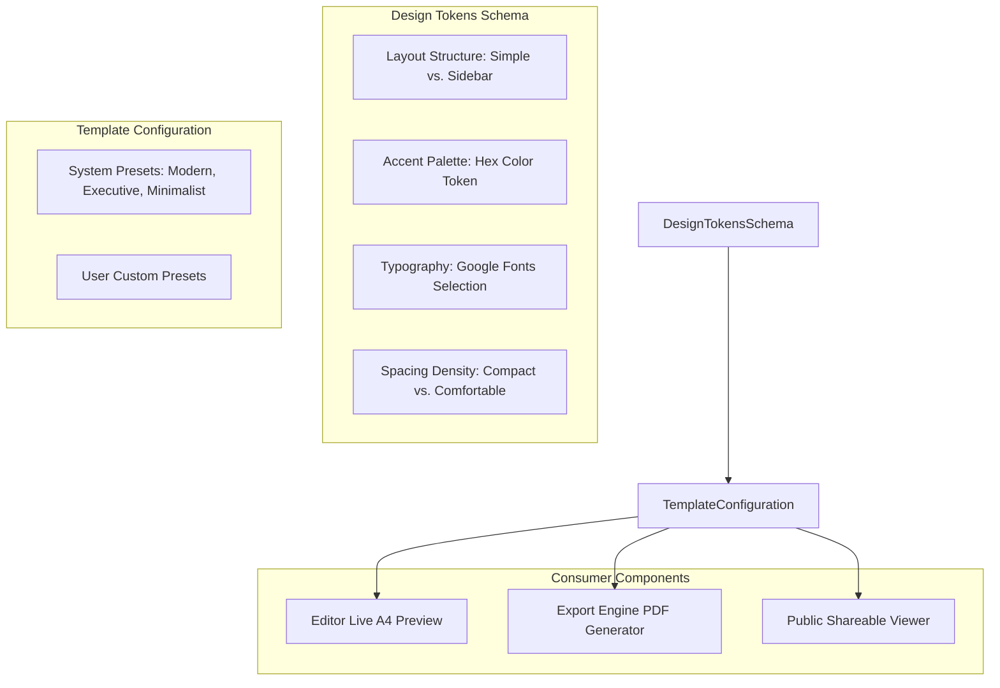

# Feature Specification: Template Gallery & Design Theming

## 1. Overview
The Template Gallery provides customizable design presets and visual styling configurations for resumes. Users can select preset templates or create personalized styling tokens controlling layout structures, accent palettes, typography, and density.

---

## 2. Architecture & Design Token Model

---

## 3. Implementation Details

### A. Frontend Layer
- **TemplateGalleryComponent** (`src/app/workspace/pages/template-gallery/template-gallery.component.ts`):
  - Displays grid of available template cards with color badges and layout tags.
  - Custom template creator modal allowing users to pick font families (`Inter`, `Outfit`, `Roboto`, `Merriweather`), primary accent colors, and layout formats.
- **TemplatesService** (`src/app/workspace/services/templates.service.ts`):
  - Manages fetching available templates and persisting custom styling configurations.
- **Styling Architecture** (`src/styles.scss`):
  - Global CSS custom properties (Design Tokens):
    - `--color-teal`: Primary dark teal accent (`#087a5b`).
    - `--color-mint`: Accent mint highlights (`#39d98a`).
    - `--font-main`: Modern clean sans-serif typography.

### B. Backend Layer
- **TemplateController** (`controllers/templateController.js`):
  - Lists global preset templates and user-created custom templates.
- **Template Model** (`models/template.js`):
  - Serializes styling metadata: `name`, `layout`, `accent`, `font`, `density`.
